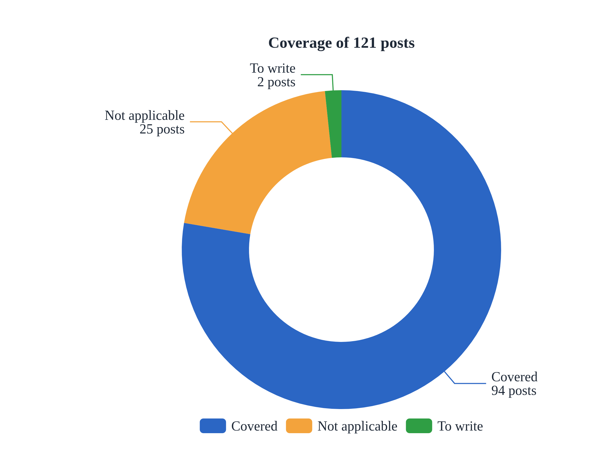
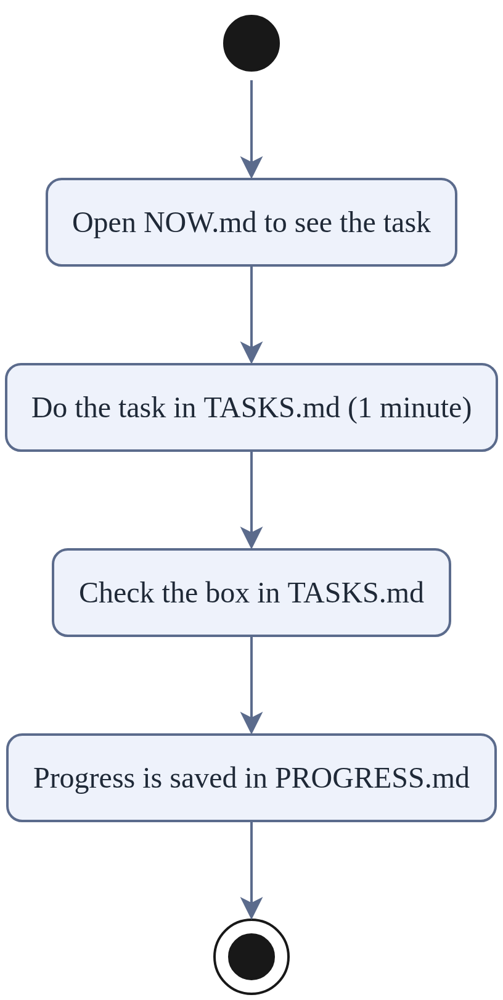

# one-minute-sam-altman

**Learn the best ideas from Sam Altman's blog, one task of one minute or less at a time.**

We went through the 121 posts on [blog.samaltman.com](https://blog.samaltman.com) (2013–2026).
We picked 85 good quotes and made **204 small tasks**. Each task takes one minute or less.
All 204 tasks together take 3.4 hours at most. That is task time only, not mastery.

## Good for short focus, including ADHD

Long articles are hard to finish in one go. This repo cuts the content into small pieces:

- **Each task takes one minute or less.** One task has one action. When it is done, check the box.
- **No daily check-in and no streak.** Missed a day? Just keep going.
- **Not finished? That is fine.** The task keeps its number. Next time, start from the same number.
- **One task at a time.** NOW.md shows only one current number.
- **No sign-up and no software to install.**

This is a way to structure learning. It is not medical advice.

## How to use it

1. Open [`NOW.md`](NOW.md) to see the current task number. First time here? Start at **SAM-0001**.
2. Do the task in [`track-sam/TASKS.md`](track-sam/TASKS.md) (1 minute or less)
3. Check the box. Write your progress in [`track-sam/PROGRESS.md`](track-sam/PROGRESS.md)

Want only the quotes? [`GEMS.md`](GEMS.md) has every quote with a link to its post.
[`LESSONS.md`](LESSONS.md) explains each quote in Chinese.

## Files

| File | What it is |
|---|---|
| `track-sam/` | The learning track: tasks and progress |
| `NOW.md` | The current task |
| `LESSONS.md` | 70 lessons with notes (in Chinese) |
| `GEMS.md` | 85 quotes, each with a link |

## Source

The quotes and lessons come from Sam Altman's blog (public feed `blog.samaltman.com/posts.atom`). The copyright belongs to Sam Altman. This repo keeps only short quotes and links to the original posts. It does not copy full articles.
