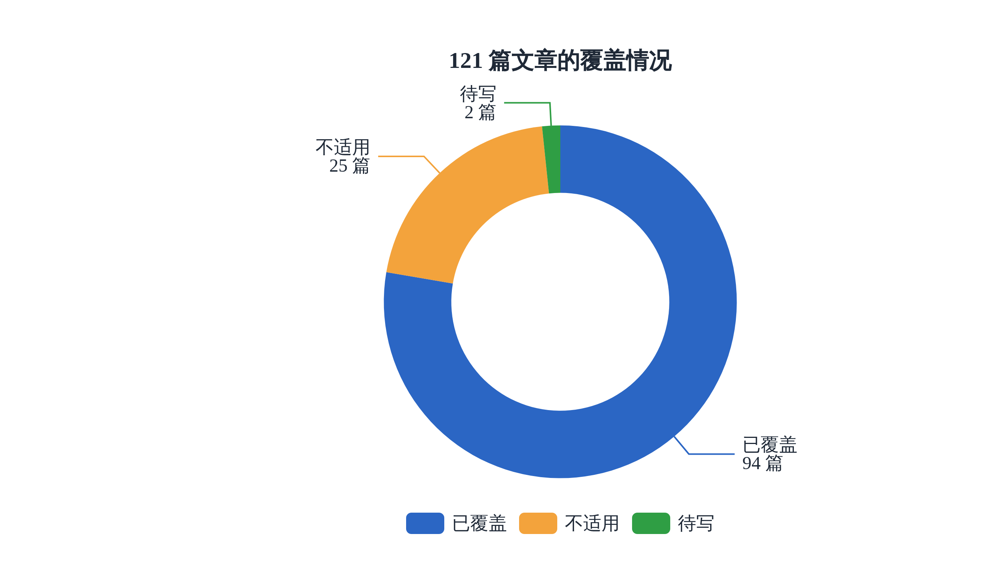
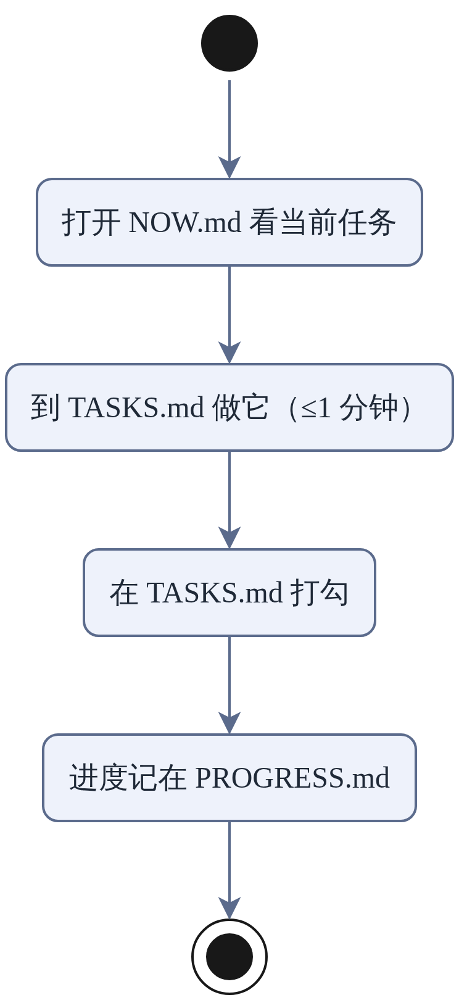

# 一分钟学习法 × Sam Altman 博客

**为 ADHD 大脑设计的一分钟学习法 × Sam Altman 博客：121 篇（2013–2026）逐条精读，每条 1 分钟——原文金句 + 中文讲解 + 怎么用。语料来自公开 Atom feed，原文版权归 Sam Altman 所有。**

我们梳理了 [blog.samaltman.com](https://blog.samaltman.com) 的 121 篇文章（2013–2026），
从中挑出 85 条金句，拆成 **205 个一分钟以内能做完的小任务**。
全部任务加起来不超过约 3.5 小时（只是任务时间，不代表掌握）。

## 适合注意力容易分散的人（包括 ADHD）

长文章不好一口气读完，这里把内容切成很小的块：

- **每个任务一分钟以内。** 一个任务只有一个动作，做完就能打勾。
- **没有打卡，也没有连续天数。** 漏了一天，接着做就好。
- **做不完也没关系。** 任务编号不变，下次从同一个编号继续。
- **一次只看一个任务。** 打开 NOW.md，只有一个当前编号。
- **不用注册，也不用安装软件。**

这是学习方式的设计，不是医疗建议。

## 怎么用

1. 打开 [`NOW.md`](NOW.md) 看当前任务编号。第一次来？直接从 **SAM-0001** 开始。
2. 到 [`track-sam/TASKS.md`](track-sam/TASKS.md) 做它（≤1 分钟）
3. 做完打勾，进度记在 [`track-sam/PROGRESS.md`](track-sam/PROGRESS.md)

不想走任务路线？直接翻 [`LESSONS.md`](LESSONS.md)：每条金句配中文讲解，1 分钟读完一条。
只要金句不要讲解 → [`GEMS.md`](GEMS.md)。

## 文件

| 文件 | 是什么 |
|---|---|
| `track-sam/` | 学习路线：任务 + 进度 |
| `NOW.md` | 当前该做哪个任务 |
| `LESSONS.md` | 70 条精读笔记（中文） |
| `GEMS.md` | 85 条金句原文，各带原文链接 |

## 来源

金句与讲解基于 Sam Altman 博客（公开 feed `blog.samaltman.com/posts.atom`）。原文版权归 Sam Altman 所有，本仓只收录短引文并附原文链接，不再附全文。

---

English: [README.en.md](README.en.md)
