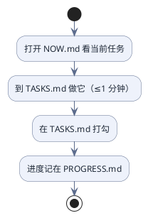

# figures

```echarts
{
  "width": 560, "height": 340,
  "title": {"text": "121 篇文章的覆盖情况", "left": "center", "top": 6, "textStyle": {"color": "#1f2937", "fontSize": 15}},
  "color": ["#2b66c4", "#f3a33c", "#2f9e44"],
  "legend": {"bottom": 6, "textStyle": {"color": "#1f2937", "fontSize": 12}},
  "series": [{
    "type": "pie",
    "radius": ["42%", "68%"],
    "center": ["50%", "52%"],
    "label": {"formatter": "{b}\n{c} 篇", "color": "#1f2937", "fontSize": 12},
    "data": [
      {"name": "已覆盖", "value": 94},
      {"name": "不适用", "value": 25},
      {"name": "待写", "value": 2}
    ]
  }]
}
```


